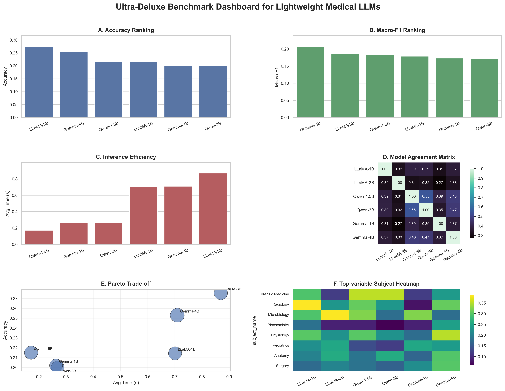
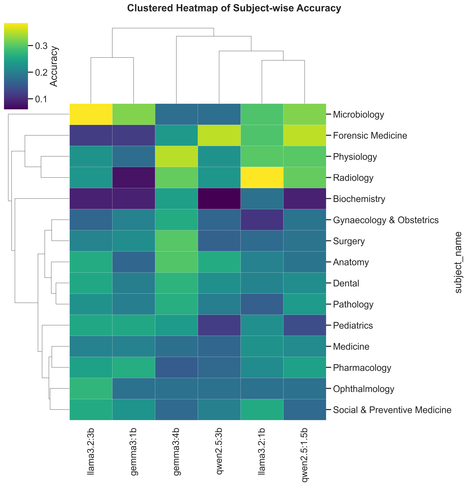
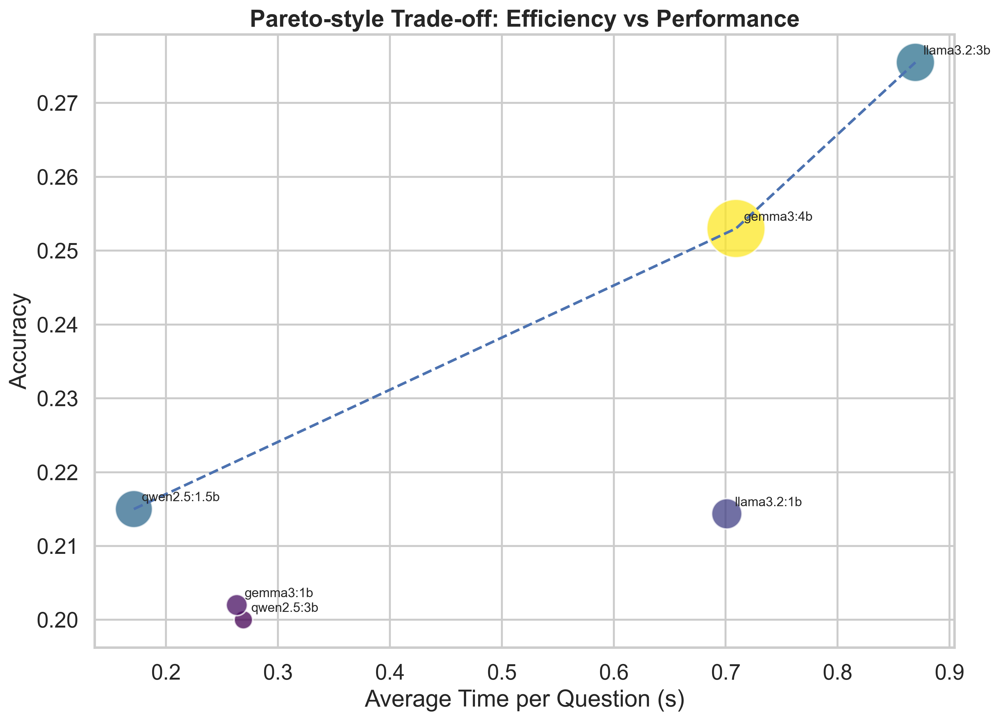
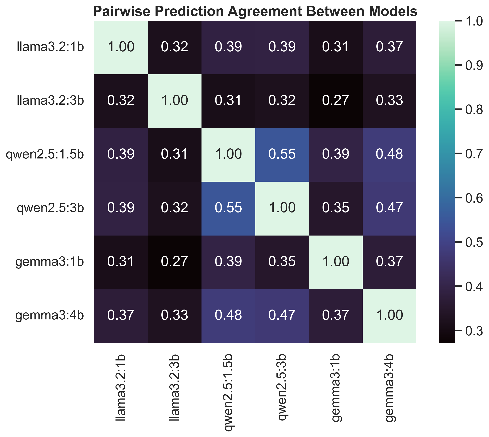
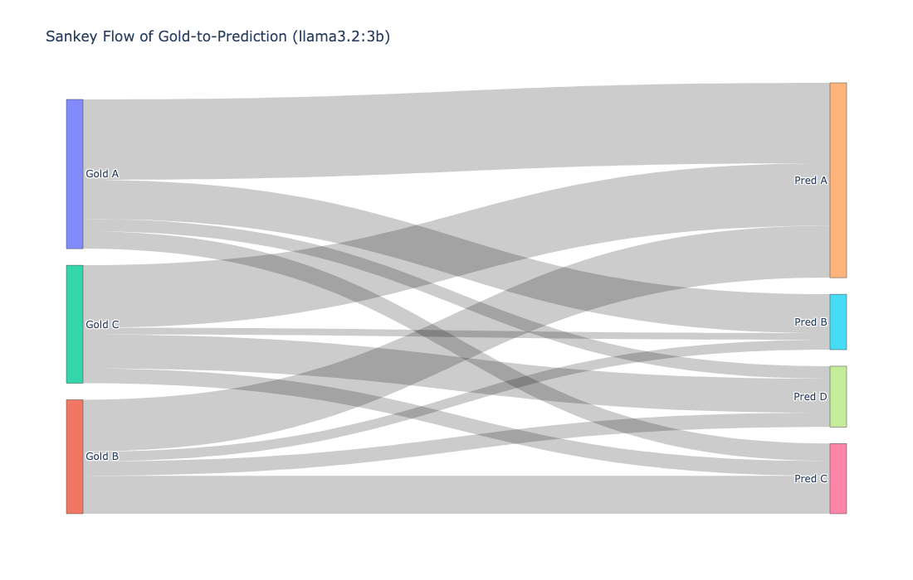

# MedScope

> A lightweight benchmark of open-source large language models for medical question answering.

  

  <b>MedScope</b> provides a reproducible and lightweight evaluation framework for benchmarking open-source LLMs on medical multiple-choice question answering.

---

## Overview

Large language models (LLMs) have demonstrated promising performance in medical question answering, yet the behavior of **lightweight open-source models** remains insufficiently explored under reproducible and resource-constrained settings.

**MedScope** is designed to address this gap by providing a lightweight benchmark for evaluating open-source LLMs on medical multiple-choice question answering with a multi-dimensional analysis framework. Instead of relying solely on a single aggregate score, MedScope jointly examines:

- predictive performance
- class-balanced behavior
- inference efficiency
- invalid response rate
- subject-wise heterogeneity
- inter-model agreement
- visualization-based trade-off patterns

This repository contains the experimental code, visualization scripts, summarized results, and paper source files associated with the MedScope benchmark.

---

## Key Features

- **Lightweight evaluation setting** for open-source medical LLM benchmarking
- **Reproducible pipeline** for dataset preparation, inference, scoring, and visualization
- **Multi-family comparison** across LLaMA, Qwen, and Gemma models
- **Multi-dimensional metrics** beyond accuracy alone
- **Visualization-rich analysis**, including clustered heatmaps, Pareto plots, Sankey diagrams, agreement matrices, and multi-panel dashboards
- **Deployment-aware perspective** emphasizing efficiency, controllability, and interpretability

---

## Evaluated Models

The current benchmark includes six lightweight open-source LLMs from three representative model families:

- **LLaMA**
  - `llama3.2:1b`
  - `llama3.2:3b`

- **Qwen**
  - `qwen2.5:1.5b`
  - `qwen2.5:3b`

- **Gemma**
  - `gemma3:1b`
  - `gemma3:4b`

---
<table>
  <tr>
    <td align="center">
       
      <b>Subject-wise Clustered Heatmap</b>
    </td>
    <td align="center">
       
      <b>Pareto Trade-off Bubble Plot</b>
    </td>
  </tr>
  <tr>
    <td align="center">
       
      <b>Model Agreement Heatmap</b>
    </td>
    <td align="center">
       
      <b>Gold-to-Prediction Sankey Flow</b>
    </td>
  </tr>
</table>

## Benchmark Setting

- **Task**: Medical multiple-choice question answering  
- **Dataset source**: MedMCQA  
- **Evaluation subset**: 1,000 sampled questions  
- **Prompting protocol**: unified single-choice output (`A`, `B`, `C`, or `D`)  
- **Metrics**:
  - Accuracy
  - Macro-F1
  - Invalid response rate
  - Average inference time per question
  - Subject-wise accuracy
  - Inter-model agreement

---
